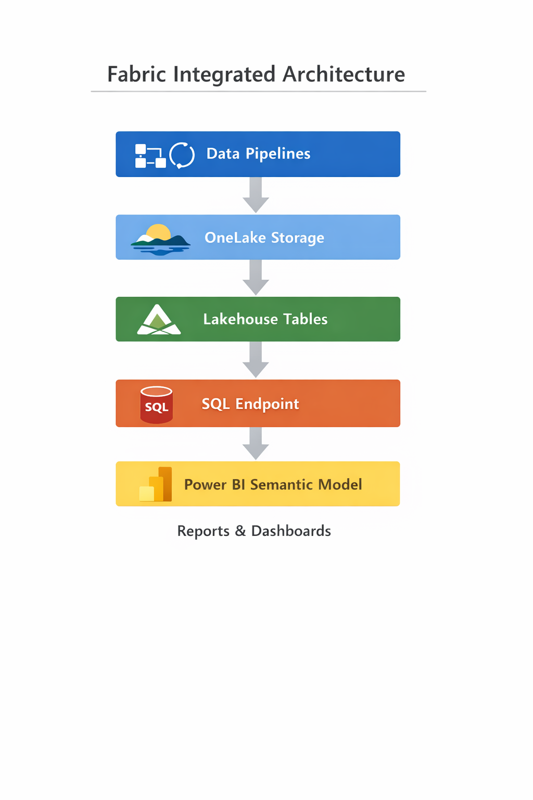

# Modern Data Platform Architecture  
### Microsoft Fabric vs Databricks vs Snowflake

This repository demonstrates how a modern analytical data platform can be implemented across three leading cloud data platforms.

The goal of this project is to compare architectural patterns across:

- **Microsoft Fabric (Lakehouse architecture)**
- **Databricks (Medallion architecture)**
- **Snowflake (Cloud Data Warehouse)**

The same analytical use case is implemented across all platforms to illustrate differences in:

• Data ingestion  
• Transformation pipelines  
• Analytical modeling  
• Platform architecture  
• Operational characteristics  

---

# Architecture Overview

The repository compares three modern data platform approaches.

| Platform | Architecture Pattern |
|--------|--------|
| Microsoft Fabric | Unified Lakehouse |
| Databricks | Medallion Architecture (Bronze → Silver → Gold) |
| Snowflake | Cloud Data Warehouse |

## Example Platform Architecture

---
# Repository Structure
docs/
architecture explanations

screenshots/
platform evidence

code/
databricks
fabric
snowflake

This repository focuses on **architecture comparison rather than tool tutorials**, showing how similar analytical workloads can be implemented across different modern data platforms.

# Key Skills Demonstrated

• Modern Data Platform Architecture  
• Lakehouse vs Data Warehouse design  
• Medallion architecture implementation  
• SQL-based analytical modeling  
• Data pipeline design  
• Cross-platform data engineering patterns  

Platforms covered:

• Microsoft Fabric  
• Databricks  
• Snowflake
